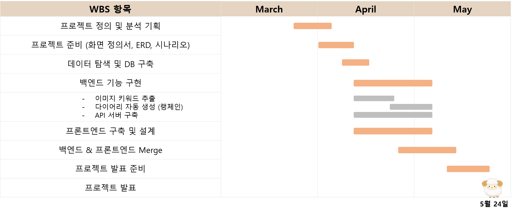
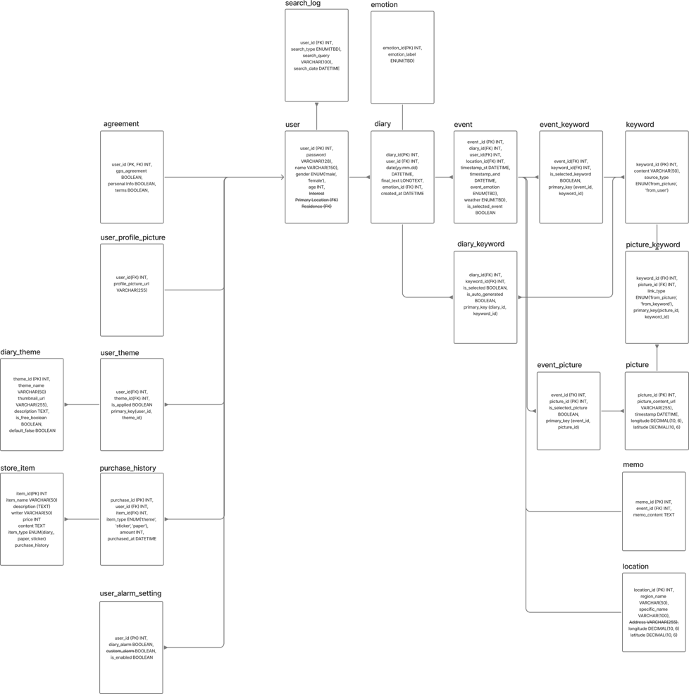
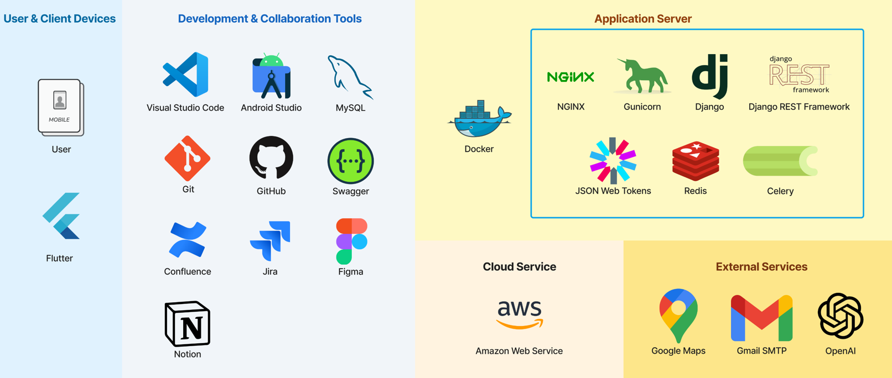
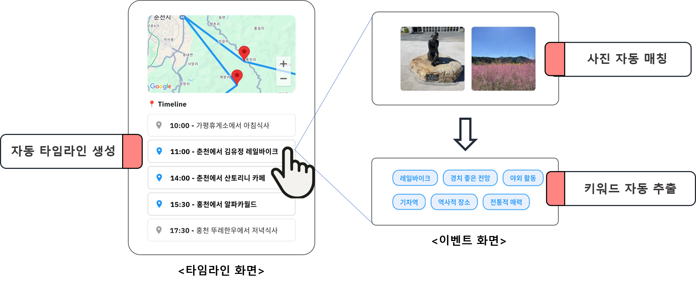

# wh03-3rd-Ateam-BorderCollies

# 프로젝트 계획서

## 1. 프로젝트 개요
- **프로젝트명**: Sheep Diary
- **목표**: AI 기반 자동 일기 생성 모바일 앱 서비스 개발
- **기간**: 2025년 3월 27일 - 2025년 5월 24일

## 2. 프로젝트 일정
- **분석 및 기획**: 2025년 3월 27일 - 4월 12일
- **개발**: 2025년 4월 14일 - 5월 14일
- **테스트 및 발표 준비**: 2025년 5월 14일 - 5월 24일

## 3. 팀 Border Collies 구성
- **박성민 | 팀장** : 프로젝트 총괄, 프론트엔드(Flutter) 리드, API 서버 구축 보조
- **김수민 | 팀원** : 백엔드 기능 총괄, 딥러닝 구현 및 테스트
- **김진욱 | 팀원** : 수석개발자, API 서버 구축 리드, 백엔드 기능 보조
- **유연우 | 팀원** : 딥러닝 구현 및 테스트, DB 관리자
- **주용민 | 팀원** : 프론트엔드(Flutter), UI/UX 설계

---
# 요구사항 정의서

## 1. 기능적 요구사항
1. 사용자 관리: 이메일 또는 소셜 계정으로 가입 및 로그인하며, 프로필을 설정할 수 있다.
2. 타임라인 자동 생성: GPS 데이터를 기반으로 하루 이동 경로를 자동으로 기록하고, 사용자는 이를 수정할 수 있다.
3. 사진 자동 매칭: 촬영 위치 정보를 이용해 타임라인과 사진을 자동으로 연결하고, 사용자가 직접 사진을 추가하거나 삭제할 수 있다.
4. AI 기반 다이어리 생성: AI가 사진과 키워드를 분석해 다이어리 내용을 자동 생성하며, 사용자가 이를 수정하거나 직접 입력할 수 있다.
5. 수동 일정 추가: 사용자는 사진 없이 텍스트로 일정을 추가할 수 있으며, AI가 이를 보완하는 이미지 생성 기능을 제공할 수 있다.
6. 다이어리 관리 및 조회: 날짜별 다이어리를 확인하고 수정할 수 있으며, 태그 기반 검색 기능이 추후 추가될 수 있다.
7. 알림 및 리마인더: 하루 요약 알림과 주간·월간 회고 기능을 제공하며, 다이어리 작성을 위한 맞춤형 리마인더를 지원한다.
8. 데이터 및 보안 관리: 클라우드 백업, 위치 정보 보호 설정, 데이터 다운로드 및 삭제 요청 기능을 제공한다.
9. 추가 고려 사항: MVP는 모바일 앱으로 개발하며, 이후 웹 버전 확장을 고려한다. SNS 공유 기능은 선택적으로 추가될 수 있다.

## 2. 비기능적 요구사항
1. 성능(Performance)
AI 일정 추천 및 분석은 1초 이내로 실행되어야 한다.
동시 접속자 1만 명 이상을 지원할 수 있어야 한다.
2. 확장성(Scalability)
사용자 증가에 따라 서버를 유연하게 확장할 수 있어야 한다.
AWS, GCP 등 클라우드 기반 인프라를 활용하여 수요 변화에 대응할 수 있어야 한다.
3. 보안(Security)
사용자 일정 및 데이터는 암호화하여 저장 및 전송해야 한다.
GDPR 및 국내 개인정보 보호법을 준수해야 한다.
4. 가용성(Availability)
서비스 가용성을 99.9% 이상 유지해야 한다.
장애 발생 시 자동 복구 기능을 갖춰야 한다.
5. 사용성(Usability)
직관적인 UI/UX를 제공하여 사용자가 쉽게 접근할 수 있어야 한다.
모바일 및 웹에서 동일한 사용자 경험을 제공해야 한다.
---

# WBS

---
# 모델 정의서(ERD)

---
# 개발 환경

---
# 주요 기능

---

